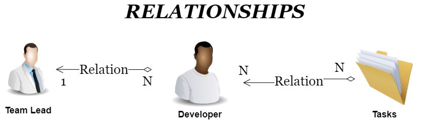

# Section 1 : Constructing Project Skeleton

## General Project Structure

Our project will be divided into two main parts: the frontend and the backend. The frontend will be responsible for the user interface and the backend will be responsible for the business logic and data storage. The frontend and backend will communicate with each other through a REST API.

In backend we will use .Net Core 6.0. Dotnet is a free and open-source, managed computer software framework for Windows, Linux, and macOS operating systems. It is a cross-platform successor to .NET Framework. The project will be divided into three main parts: the API, the business logic, and the data access layer. The API will be responsible for receiving requests from the frontend and sending responses back. The business logic will be responsible for the business logic of the application. The data access layer will be responsible for communicating with the database.

In database we will use PostgreSQL. I will running PostgreSQL in a Docker container but you can also install it locally on your machine. 

## UML Diagram

We have a base entity class called `BaseEntity` which will be extended by all other entities. It contains the `id` field which will be used to uniquely identify each entity. We have `TokenableBaseEntity` class which extends `BaseEntity` and contains the `token` field. This class will be extended by all entities that need to be tokenable.

We have `Developer` class which extends `TokenableBaseEntity` class it means that every Developer will authentication token through login and register. We have `TeamLead` class manages Developers and assign them newTasks.

* One Developer can have many Tasks and one Task can have many Developers. 

* One TeamLead can have many Developer to manage but one Developer can have only one TeamLead.